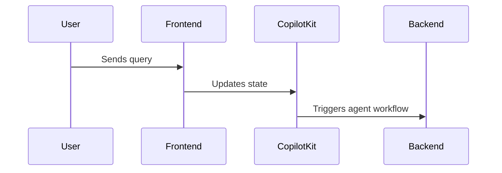

# Document 1: How the Current Codebase Works to Prepare MCP Tools, Context, and the Conversation Flow

This document explains how the current open-mcp-client codebase handles MCP tool preparation, context management, and conversation flow using LangGraph + LangChain architecture.

## Architecture Overview

The open-mcp-client uses a sophisticated multi-layer architecture that combines several modern technologies:

- **LangGraph**: Workflow orchestration and state management
- **LangChain**: LLM integration and ReAct agent pattern
- **CopilotKit**: Frontend-backend state synchronization
- **MultiServerMCPClient**: MCP protocol implementation
- **Next.js 15 + Turbopack**: Frontend with React 19
- **FastMCP**: MCP server creation framework

## Current MCP Tools Preparation Flow

### 1. Connection Setup (Per Request)

The current implementation establishes fresh MCP connections for every user request:

```python
async def chat_node(state: AgentState) -> dict:
    # Merge default and user configurations
    enabled_mcp_config = {}
    for name, config in default_mcp_config.items():
        user_config = state.get("mcp_config", {}).get(name, {})
        enabled = user_config.get("enabled", config.get("enabled", True))
        if enabled:
            merged_config = {**config, **user_config}
            enabled_mcp_config[name] = merged_config

    # Fresh connection per request
    async with MultiServerMCPClient(enabled_mcp_config) as mcp_client:
        mcp_tools = mcp_client.get_tools()
        react_agent = create_react_agent(model, mcp_tools)
```

**Key Characteristics:**
- Connections are established fresh for each user message
- Tools are discovered dynamically every time
- No connection pooling or caching
- High latency due to repeated connection overhead

### 2. Tool Registration Pattern

Tools discovered from MCP servers are passed directly to the ReAct agent:

```python
react_agent = create_react_agent(model, mcp_tools)
agent_executor = AgentExecutor(
    agent=react_agent, 
    tools=mcp_tools, 
    verbose=True,
    handle_parsing_errors=True
)
```

**Limitations:**
- All available tools are registered regardless of query context
- No intelligent tool filtering or selection
- Potential for tool flooding in complex scenarios

## Current Context Management

### Message History Handling

The system implements a simple truncation strategy for conversation history:

```python
MAX_MESSAGES = 10

def prepare_conversation_context(state: AgentState) -> List[BaseMessage]:
    all_messages = state["messages"]
    
    # Simple truncation to last 10 messages
    conversation_messages = (
        all_messages[-MAX_MESSAGES:] 
        if len(all_messages) > MAX_MESSAGES 
        else all_messages
    )
    
    # Prepend system prompt
    system_message = SystemMessage(content=state.get("system_prompt", SYSTEM_PROMPT))
    return [system_message] + conversation_messages
```

**Issues with Current Approach:**
- Static message limit without considering token count
- No intelligent pruning of tool results
- Large tool responses count fully toward context
- No consideration of message importance or relevance

### State Persistence

State management uses CopilotKit's synchronization:

```typescript
// Frontend state management
const {
  state,
  setState,
  // ... other CopilotKit hooks
} = useCopilotKitState<AgentState>({
  mcp_config: defaultMCPConfig,
  selected_model: 2, // Default to OpenAI o1-mini
  system_prompt: SYSTEM_PROMPT
});

// Persisted in localStorage via useLocalStorage hook
const [persistedState, setPersistedState] = useLocalStorage('mcp-client-state', initialState);
```

## Current Conversation Flow

### 1. User Request Initiation


### 2. Backend Processing
```python
async def chat_node(state: AgentState) -> dict:
    # 1. Merge and filter MCP configurations
    enabled_mcp_config = merge_mcp_configs(state)
    
    # 2. Establish fresh MCP connections
    async with MultiServerMCPClient(enabled_mcp_config) as mcp_client:
        # 3. Discover all available tools
        mcp_tools = mcp_client.get_tools()
        
        # 4. Select and instantiate LLM model
        model = get_model(state.get("selected_model", 2))
        
        # 5. Prepare conversation context (last 10 messages)
        agent_input_messages = prepare_conversation_context(state)
        
        # 6. Create and invoke ReAct agent
        react_agent = create_react_agent(model, mcp_tools)
        agent_executor = AgentExecutor(agent=react_agent, tools=mcp_tools)
        
        # 7. Process with agent
        result = await agent_executor.ainvoke({
            "messages": agent_input_messages
        })
        
        return {"messages": [result["output"]]}
```

### 3. ReAct Agent Processing
```python
# Inside ReAct agent execution:
# - LLM reasons about the query
# - Determines which tools to call
# - Makes tool calls via MCP client
# - Processes tool responses
# - Generates final response
```

## Performance Bottlenecks in Current Architecture

### 1. Connection Overhead
- **Problem**: Fresh MCP server connections per request
- **Impact**: 200-500ms latency per connection
- **Scale Impact**: Multiplied by number of enabled MCP servers

### 2. Tool Discovery Latency
- **Problem**: Full tool discovery on every request
- **Impact**: Additional 100-300ms per server
- **Compounding**: Grows linearly with server count

### 3. Context Window Inefficiency
- **Problem**: Tool results accumulate in conversation context
- **Example**: `listAvailableModels` returning 10,000+ tokens
- **Impact**: Rapid context window consumption

### 4. No Intelligent Tool Selection
- **Problem**: All tools registered regardless of query relevance
- **Impact**: Increased prompt size and processing time
- **Missed Opportunity**: No semantic filtering or progressive disclosure

## Current System Prompt Strategy

```python
SYSTEM_PROMPT = """
You are an AI assistant specialized in Sage Intacct operations...
[Static system prompt with general instructions]
"""
```

**Limitations:**
- No tenant-specific schema preloading
- Misses OpenAI prompt caching opportunities
- Generic instructions without context optimization

## State Management Architecture

### Frontend State (React/TypeScript)
```typescript
interface AgentState extends CopilotKitState {
  mcp_config: Record<string, MCPServerConfig>;
  selected_model: number;
  system_prompt: string;
  messages: Array<BaseMessage>;
}
```

### Backend State (Python)
```python
class AgentState(TypedDict):
    messages: Annotated[list[BaseMessage], add_messages]
    mcp_config: dict
    selected_model: int
    system_prompt: str
```

**Synchronization:**
- CopilotKit handles state sync between frontend and backend
- localStorage provides client-side persistence
- No server-side conversation persistence

## Current Limitations Summary

### Performance Issues
1. **High Latency**: Fresh connections and tool discovery per request
2. **Resource Waste**: No connection pooling or caching
3. **Context Bloat**: Tool results consume conversation context
4. **Scaling Problems**: Linear performance degradation with server count

### Functional Limitations
1. **No Tool Intelligence**: All tools registered regardless of relevance
2. **Simple Context Management**: Static truncation without token awareness
3. **Limited Caching**: No prompt caching optimization
4. **No Progressive Disclosure**: Tools not loaded on-demand

### Architecture Constraints
1. **Stateless Processing**: No conversation-level persistence
2. **Request-Response Model**: No streaming or incremental updates
3. **Limited Error Handling**: Basic error propagation
4. **No Analytics**: Limited insight into tool usage patterns

## Opportunities for Optimization

The current architecture provides a solid foundation but has clear optimization opportunities:

1. **Connection Pooling**: Persistent MCP server connections
2. **Tool Caching**: Cache tool discovery results
3. **Intelligent Context Management**: Token-aware pruning and caching
4. **Progressive Tool Loading**: Load tools on-demand based on query analysis
5. **Conversation Threading**: Leverage OpenAI's conversation API
6. **Schema Preloading**: Cache tenant-specific schemas in system prompts

This analysis sets the stage for understanding how next-generation APIs and optimization strategies can dramatically improve performance and capabilities.
